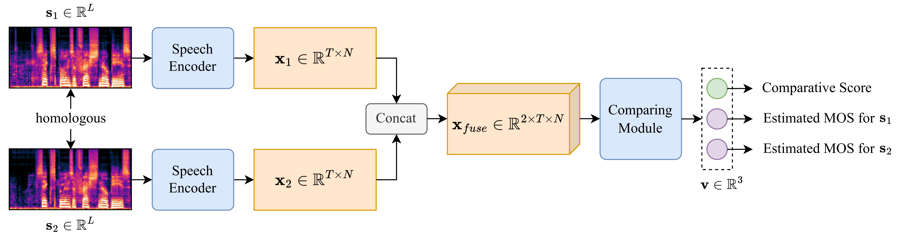

# URGENT-PK: Perceptually-Aligned Ranking Model Designed for Speech Enhancement Competition

This is the official implementation of ["URGENT-PK: Perceptually-Aligned Ranking Model Designed for Speech Enhancement Competition"](https://arxiv.org/abs/2506.23874) submitted to *ASRU 2025*.

>**Abstract:**<br>
The Mean Opinion Score (MOS) is fundamental to speech quality assessment. However, its acquisition requires significant human annotation. Although deep neural network approaches, such as DNSMOS and UTMOS, have been developed to predict MOS to avoid this issue, they often suffer from insufficient training data. Recognizing that the comparison of speech enhancement (SE) systems prioritizes a reliable system comparison over absolute scores, we propose URGENT-PK, a novel ranking approach leveraging pairwise comparisons. URGENT-PK takes homologous enhanced speech pairs as input to predict relative quality rankings. This pairwise paradigm efficiently utilizes limited training data, as all pairwise permutations of multiple systems constitute a training instance. Experiments across multiple open test sets demonstrate URGENT-PK's superior system-level ranking performance over state-of-the-art baselines, despite its simple network architecture and limited training data.



## Quick Start

```
git clone https://github.com/urgent-challenge/URGENT-PK.git
cd urgentpk
pip install -e ./
```

## To train the URGENT-PK model

### An instruction example

```
python urgentpk/train_urgentpk.py --dataset data/urgent24 --delta 0.30 --encoder mel --backbone resnet34
```

### Important arguments:

* `--dataset` indicates the path of the dataset folder.
    
* `--delta` sets the 'MOS difference threshold' in data cleaning, only speech pairs with a MOS difference larger than this threshold are included in the training data.

* `--encoder` sets the encoder in the model, we have provided `mel` and `stft`, you can design your own encoder in `urgentpk/urgentpk_encoder.py`.

* `--backbone` sets the comparing module in the model, we have provided `resnet34`, you can build your own model in `urgentpk/urgentpk_backbone.py`.

## To test the URGENT-PK model

### An instruction example:

```
python urgentpk/rank.py --ckpt_path exp/latest.ckpt --dataset data/urgent25 --subset test --score_mode logit_binary_vote
```

### Important arguments:

* `--ckpt_path` indicates the path to the checkpoint.

* `--subset` decides the subset to perform the ECS algorithm, should be `valid` or `test`.

* `--dataset` indicates the path of the dataset folder.

* `--score_mode` sets the scoring strategy of the ECS algorithm, we have provided the following options:

    * `logit_binary_vote`: the **Binary Scoring** Strategy.

    * `logit_non_binary_vote`: the **non-Binary Scoring** Strategy.

    * `get_mos_dup`: the **Replication Strategy** in the **ablation study** on the Predicted MOS.

    * `get_mos_noise`: the **Noisy-Speech Strategy** in the **ablation study** on the Predicted MOS.

* `--noisy_team` points out the team made up of untreated noisy speeches, which only works when `--score_mode get_mos_noise`.

## Pretrained models

We have provided several pretrained model checkpoints, corresponding to the models tested in our [paper](https://arxiv.org/abs/2506.23874). Note that you have to install [UTMOS](https://github.com/sarulab-speech/UTMOS22) manually if you want to use the UTMOS-based URGENT-PK models.

|Encoder|Decoder|Training Data|Download|
|:-----:|:-----:|:-----------:|:------:|
|Log-Mel Spectrum|ResNet34|Urgent Challenge 2024|[Huggingface :satisfied:](https://huggingface.co/Twinkzzzzz/URGENT-PK/blob/main/mel_resnet34_urgent24.ckpt)|
|[UTMOS](https://github.com/sarulab-speech/UTMOS22) *(fixed)*|ResNet34|Urgent Challenge 2024|[Huggingface :satisfied:](https://huggingface.co/Twinkzzzzz/URGENT-PK/blob/main/utmos_fix_resnet34_urgent24.ckpt)|
|[UTMOS](https://github.com/sarulab-speech/UTMOS22) *(fine-tuned)*|ResNet34|Urgent Challenge 2024|[Huggingface :satisfied:](https://huggingface.co/Twinkzzzzz/URGENT-PK/blob/main/utmos_ft_resnet34_urgent24.ckpt)|

## To build your own dataset for URGENT-PK

Suppose a total of *K* systems, the dataset folder should follow the structure as:

```
dataset-name/
├── split.json
├── system-name-1/
│   ├── wav.scp
│   └── mos.scp
│   ...
└── system-name-K/
    ├── wav.scp
    └── mos.scp
```

where `split.json` splits the dataset into `training`, `validation` and `testing` subsets by a dictionary like:

```
{
    "tr": [...]
    "cv": [...]
    "tt": [...]
}
```

Remember to make sure that each system folder contains the same utterances. If you need to make more modification, the dataset is loaded by `PKDataset()` in `urgentpk/PKDataset.py`. In the training stage, `PKDataset()` returns a pair of lists containing wave pairs and MOS pairs in `__init__()`. In the validation and testing stage, `PKDataset()` returns a pair of `scp` dictionaries in `load_wavs_cv()` and `load_wavs_tt()`.